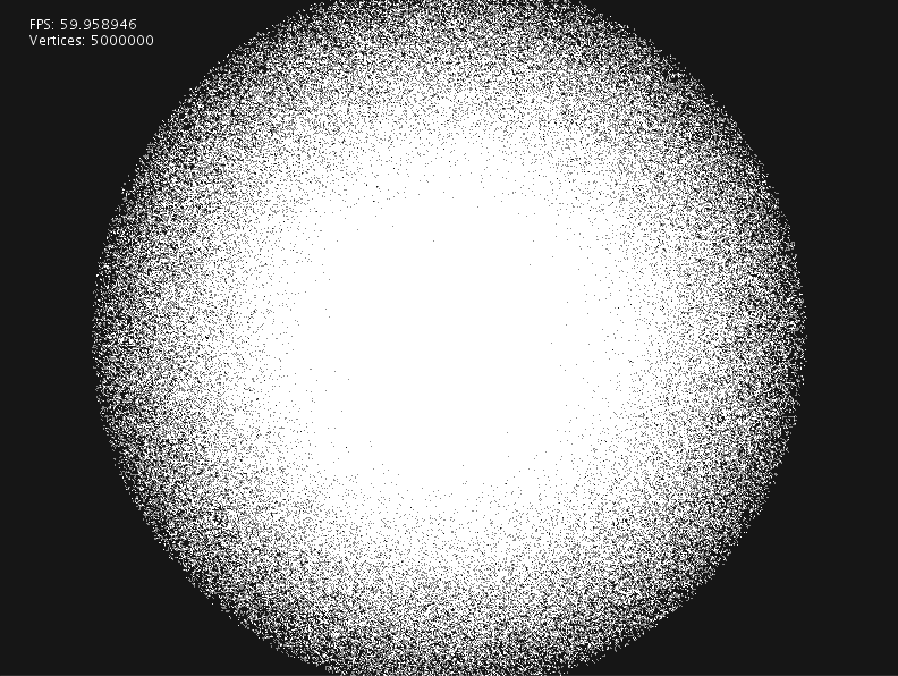

# Point Cloud for Processing  
A point cloud visualisation and analysis library for the [Processing](https://processing.org/) framework.

*Figure 1: 5'000'000 points with 60 FPS rendered on a Radeon Pro 460*

### Idea
This framework allows you to display millions of points within your Processing sketch. The idea was to build a simple, although a performant framework, which can load, display, and even analyze point cloud data.

#### Speed

[PShape](https://github.com/processing/processing/blob/master/core/src/processing/opengl/PShapeOpenGL.java) can display points with the point shader, but because processing tessellates each point on the CPU, manipulations to the point cloud data are slow, plus there is overhead because even more vertices are allocated then needed on modern graphic systems. This pipeline uses the OpenGL commands to generate the billboarding & tessellation directly on the graphics card, which leads to a faster drawing and simple one-to-one vertex indexing.

#### Attributes
With the original PShape, it was possible to add custom vertex attributes to a mesh. However, in `POINTS` mode, the tessellation would not care about these additional custom vertex attributes, as shown [here](https://github.com/processing/processing/issues/5895). Instead, this library offers you the full potential of vertex attributes for point vertices.

### Library Modules
The plan is to have three modules to work with point clouds. The most important is the visualization module, which contains an advanced OpenGL renderer for point clouds.

- I/O 🐙
	- read PLY files
- Visualize 🎆
	- OpenGL renderer ✅
- Analyze 🧮
	- Show cloud statistics
		- dimensions
		- pointcount

### Example
I have added some very basic examples, because people were asking me about it.

Currently there are two problems you have to deal with:

0. I can not get processing to redraw, if nothing in the scene is drawn by processing. This is why I've added a simple line to the output while rendering.
1. The library is far away from being finished. This is a work in progress thing and I am happy if you contribute your findings back to me.

#### Basic Cloud Example

[examples/BasicPointCloud](examples/BasicPointCloud)

#### Simple Load Example

[examples/BasicPointCloud](examples/BasicPointCloud)

### About

